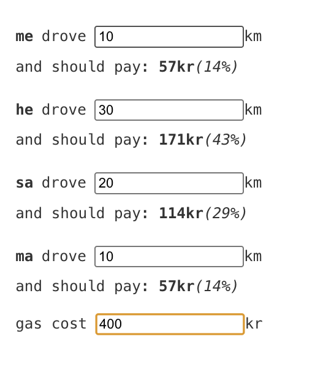

# gas-cljs

app to calculate gas costs.

[live version](https://merisbahti.github.io/gas-cljs/)



### Development mode
```
npm install
npx shadow-cljs watch app
```
start a ClojureScript REPL
```
npx shadow-cljs browser-repl
```
### Building for production

```
npx shadow-cljs release app
```
